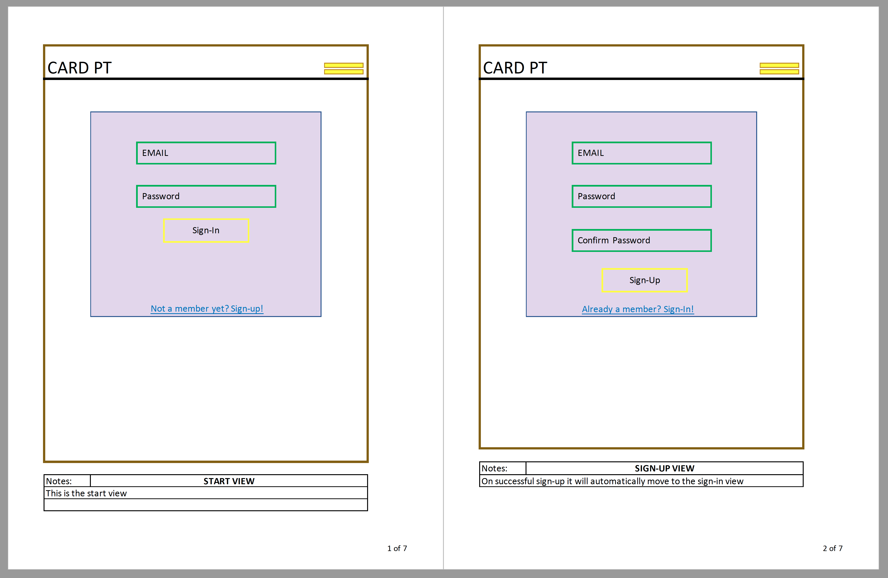
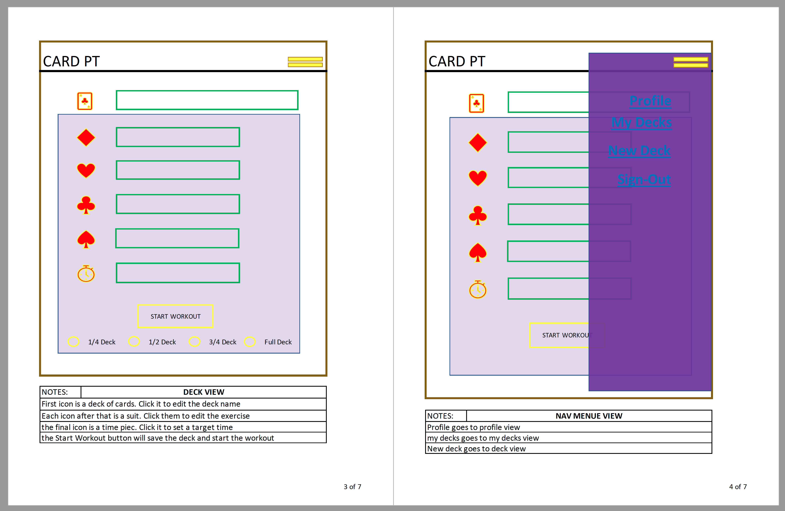
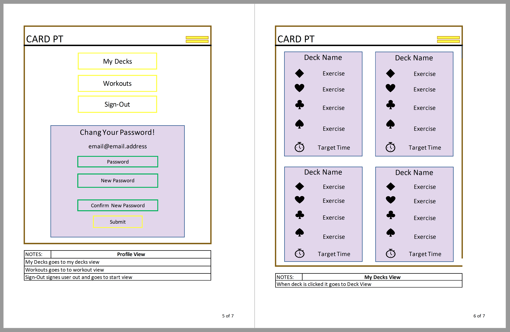
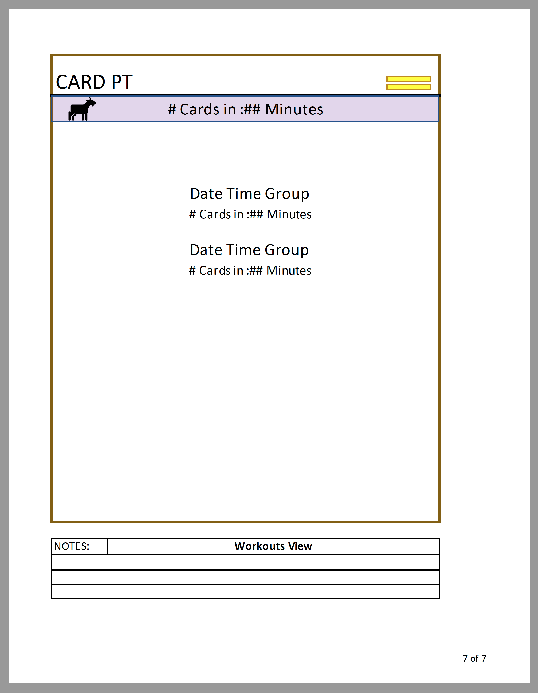
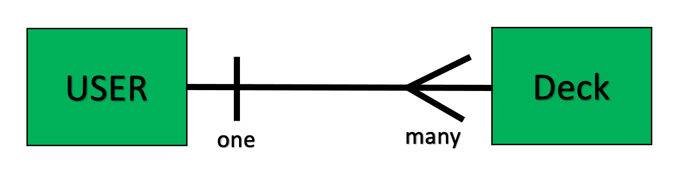

# Card PT: a card game like no other!

## Description

  This application enables the user to set up a killer workout with nothing but their mobile device and their body. The simple design and intuitive functionality make setting up a custom workout with whatever equipment is available, or with no equipment at all, a smooth process, allowing the user to focus on their godly gains instead of figuring out a complex routine for the day. Users can use it as a supplemental workout with a quick quarter deck round or they can crush an entire group with a full deck round. 

  I wanted to create this app because I loved (and hated) card pt when I ran physical training for my team while in the Army, but I often forgot to bring a deck of cards or the cards would get torn up, this way it's right there on your phone nothing extra needed.

## Important Links

  -[API REPO](https://github.com/CaldoNic7/card-pt)

  -[Client Repo](https://github.com/CaldoNic7/card-pt-client)

  -[Deployed API](www.link.com)

  -[Deployed Client](www.link.com)

## Technologies Used
  
  jQuery
  HTML/CSS
  Bootstrap
  Javascript
  Express
  Mongoose
  Mongodb

## Planning
  
  Version 1 - August 5th 2021

### User Stories
  As a user I want to be able to ...
      1. Create an account
      2. Change my password
      3. Sign in and out of my account
      4. Create a deck (or multiple decks) of cards
      5. Assign each suit a different and custom exercise
      6. Choose the size of the deck (quarter deck, half deck, three quarter deck, full deck)
      7. Set a goal time to complete the deck by
      8. Review past 'games'
      9. Easily see my personal record (number of cards completed in the shortest amount of time)
      10. Delete a deck
      11. Change or update a deck later
      12. Easily see each deck and it's assigned exercises and choose between them
      13. ...

### Wireframes

  Wireframe Version 1 - 8/04/21 

  views 1 and 2 
  views 3 and 4 
  views 5 and 6 
  view 7 

<!-- ### Unsolved Problems -->

### Resources and Entity Relationship Diagrams (ERD)

  ### Resources
  #### User
    user: {
     email: {
       type: String,
       required: true
     },
     hashedPassword: {
       type: String
       required: true
     } 
    }
  #### Deck
    deck: {
      name: {
      type: String,
      required: true
    },
    exercise: {
      type: Array,
      required: true
    },
    timer: Number,
    personalRecord: [a pr sub-document]
    }
  #### Personal Record (pr) sub-document
    pr sub-document: {
      deckName: String,
      date: Date,
      exercises: Number,
      time: Number,
      cardsCompleted: Number
    }

  ### ERD

  Version 1 - 8/04/21

  Diagram 1 

  

### Timeline
  #### Version 1
  #### Aug 4 & 5 Planning
    ^ Create README.md
      8/5  ~~ description ~~
      ~ important links
      8/5    ~~ api repo link ~~
      8/5    ~~ client repo link ~~
        ~ deployed api link
        ~ deployed client link
      8/5  ~~ user Stories ~~
      8/5  ~~ wireframes ~~
      8/5  ~~ resources ~~
      8/5  ~~ erd ~~
      8/5 ^~~ Develop Timeline ~~
  #### Aug 5 Set UP
    8/5  ^ API
      8/5  ~ download express api template
      8/5  ~ create github repo
      8/5  * commit
    8/5  ^ Client
      8/5  ~ download browser template
      8/5  ~ create github repo
      8/5  * commit
   #### Aug 6 & 7 API
    ~ crud resources
    ~ test resource's end points with postman
      * commit
    ~ add the relationship to a user
      * commit
    ~ add user ownership to resource controller
    ~ test resource's end points with postman
      *commit
    ~ deploy to heroku
  #### Aug 8 - 10 Client
    ^ aug 8 (User Account Actions)
      ~ sign-up
        * commit
      ~ sign-in
        ~commit
      ~ sign-out
        * commit
      ~ change password
        * commit
      ~ all api calls have success or failure messages
        * commit
      ~ deploy to github repo
    ^ aug 9 (Resource Functionality)
      ~ Create resource 
        * commit
      ~ get all owned resources
        * commit
      ~ delete single resource
        * commit
      ~ update single resource
        * commit
      ~ deploy to github
    ^ aug 10 (Final Touches)
      ~ testing/troubleshooting/debugging
      ~ styling

## Styling
  ### Fonts
    ^ header fonts
    ^ body fonts
    ^ accent fonts

  ### Colors
    ^ background colors
     
    ^ font colors
      ~ header
      ~ body
      ~ accent
      ~ links
    
    ^ accent colors

  ### Images
    ^ background
    ^ card icons
      ~ diamonds
      ~ hearts
      ~ clubs
      ~ spades
    